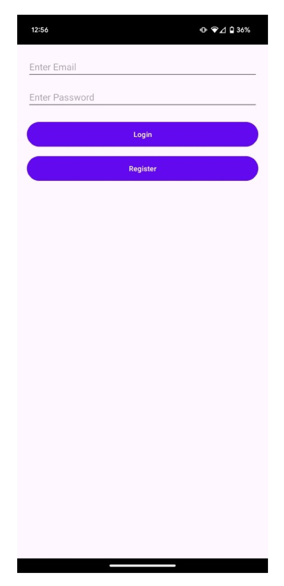
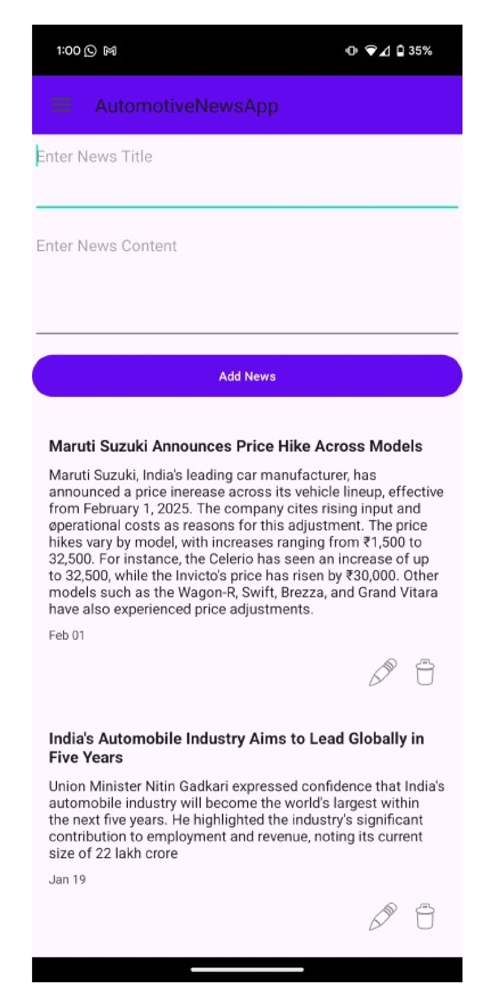
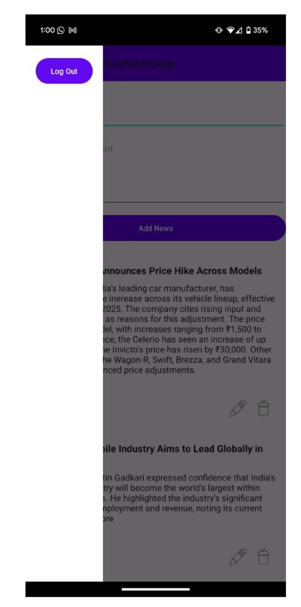

# GetInsights Android App

GetInsights is an Android application that delivers the latest updates from the **automotive sector**. The app focuses on providing timely, structured news content with a clean and user-friendly interface, backed by Firebase services for authentication and realtime data delivery.

---

## 🧩 Project Overview

The application follows a standard Android architecture with:
- Activities managing UI screens and user flow
- Adapter pattern for RecyclerView-based news listing
- Firebase Authentication for secure login and registration
- Firebase Realtime Database for realtime news content delivery

---

## 📌 Features

- User registration and login using **Firebase Authentication**
- Role-based access for **Admin and Normal Users**
- Admin-controlled news publishing through the application
- News content can also be managed via **Firebase Console**
- Display of latest news with title, content, and timestamp
- Navigation Drawer for smooth and intuitive app navigation
- Clean and minimal UI focused on readability
- Realtime updates using **Firebase Realtime Database**

---

## 📱 Screenshots

### 🔐 Login Activity

### 🛠 Admin Activity

### 🧭 Navigation Drawer

### 📰 News Activity

---

## 🔐 Security Considerations

Sensitive configuration files such as `google-services.json` and `local.properties` are intentionally excluded from this public repository to prevent exposure of credentials and environment-specific data.

Firebase database access should be secured using proper authentication and role-based access rules.

---

## 🚀 How to Run the Project

1. Clone the repository
2. Open the project in **Android Studio**
3. Add your own `google-services.json` file
4. Sync Gradle files
5. Run the app on an emulator or physical device

---

## 🛠 Tech Stack

- **Language:** Java  
- **UI:** XML  
- **Backend Services:** Firebase Authentication, Firebase Realtime Database  
- **IDE:** Android Studio  

---

## 📌 Notes

- News content can be published by admin users through the application and managed directly via Firebase Console
- This repository represents the Android client of the GetInsights platform

---

## 👤 Author

**Amuthan R N  and 
Ganeshprabu M**
